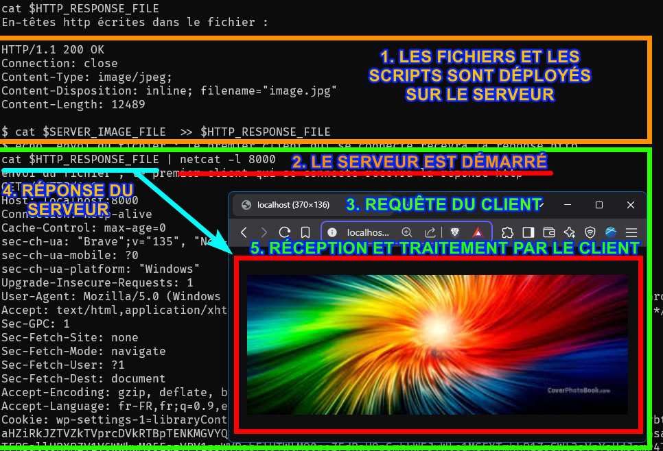

# netcat - Serveur http manuel

## 1. Ouvrir un serveur

  ```bash
  # récupérer l’adresse IP
  IP=`ip a`      
  # démarrer le serveur
  netcat -l 8000
  ```
  
## 2. Ouvrir un (des) client(s) http

  ```bash
  IP=localhost
  curl http://${IP}:8000
  chrome http://${IP}:8000
  ```
  
## 3. Observer les données envoyées par les clients http à notre serveur HTTP

  Données renvoyées par `curl`

  ```http
  GET / HTTP/1.1
  Host: localhost:8000
  User-Agent: curl/8.11.1
  Accept: */*
  ```

  Données renvoyées par `(votre navigateur)`
  
  ```http
  GET / HTTP/1.1
  Host: localhost:8000
  Connection: keep-alive
  Cache-Control: max-age=0
  User-Agent: Mozilla/5.0 (Windows NT 10.0; Win64; x64) AppleWebKit/537.36 (KHTML, like Gecko) Chrome/135.0.0.0 Safari/537.36
  Accept: text/html,application/xhtml+xml,application/xml;q=0.9,image/avif,image/webp,image/apng,*/*;q=0.8
  Accept-Encoding: gzip, deflate, br, zstd
  Accept-Language: fr-FR,fr;q=0.9,en-US;q=0.8,en;q=0.7
  ```
  
    
## 4. Envoyer une réponse http au clavier 

Redémarrer le serveur en précisant `--crlf`
  
```bash
# serveur netcat
ncat --crlf  -l 8000
```
  
Le navigateur envoi une requête sur `http://localhost`
  
Le format d'une réponse http est :

```http
HTTP/Version 200 OK\r\n
Http-Header: Http-Header-Value\r\n
\r\n
Http-Body
```

Notez bien que les sauts de ligne sont `crlf` (`\r\n`).

En HTTP/1.1 il faut penser à `Connection: close`.
     
```http
HTTP/1.0 200 OK
Content-Type: text/html; charset=utf-8
Connection: close
Content-Length: 25

<h1>ceci est un test</h1>
ceci pourrait être ignoré content-length vaut 25
```

## 5. Envoyer une image au navigateur Internet

Pour simplifier, on va préparer un fichier qui contient la réponse http complète. On pourrait également utiliser un pipe mais c’est plus compréhensible comme ça.  

```bash
# configuration/initialisation du script
SERVER_IMAGE_FILE=image.jpg
[ -f $SERVER_IMAGE_FILE ] || (echo "fichier image non trouvé" : exit)
MIME_TYPE=`file -b --mime-type ${SERVER_IMAGE_FILE}`
echo "Type mime détecté : "${MIME_TYPE}
FILE_SIZE=`stat -c %s ${SERVER_IMAGE_FILE}`
echo "La taille du fichier est : "${FILE_SIZE} octets.
HTTP_RESPONSE_FILE="image.http_response"

# en-têtes http envoyées au navigateur
printf "HTTP/1.1 200 OK\r\n" > $HTTP_RESPONSE_FILE
printf "Connection: close\r\n" >> $HTTP_RESPONSE_FILE
printf "Content-Type: "${MIME_TYPE}";\r\n" >> $HTTP_RESPONSE_FILE
printf "Content-Disposition: inline; filename=\"image.jpg\"\r\n" >> $HTTP_RESPONSE_FILE
printf "Content-Length: 12489\r\n\r\n" >> $HTTP_RESPONSE_FILE
echo "En-têtes http écrites dans le fichier :"
echo ""
cat $HTTP_RESPONSE_FILE
echo ""
ls -l $HTTP_RESPONSE_FILE

# ajout du fichier
cat $SERVER_IMAGE_FILE  >> $HTTP_RESPONSE_FILE 

echo "Le fichier ${HTTP_RESPONSE_FILE} est prêt et complet. Il contient une réponse http complète."
echo "vous pouvez comparer le fichier original et la réponse"
ls -l $SERVER_IMAGE_FILE $HTTP_RESPONSE_FILE
```

### Envoi de la réponse 

```bash
echo "vérification du port avec la commande lsof"
[ `lsof -i :8000 > /dev/null; echo $?` -gt 0 ] || (echo "le port 8000 est occupé"; exit)
lsof -i :8000
echo "envoi du fichier ; le premier client qui se connecte recevra la réponse http"
cat $HTTP_RESPONSE_FILE | netcat -l 8000
```



## 6. Envoyer une requête http via un script bash

Utiliser `wsl` ou `linux`, non pas powershell.
l
On va se connecter à google. On a besoin des autorités de certification.
 
```bash
ls http_cacert.pem || || (echo "fichier http_cacert.pem manquant ; à trouver sur Internet : https://curl.se/docs/caextract.html" ; exit 1)
connectToHost="google.fr:443" ; \
userAgent="openssl"
opts=
#opts="-ignore_unexpected_eof -tls1_3" # --quiet
(
    printf "GET / HTTP/1.1\n" ; \
    printf "Host: %s\n" "$connectToHost" ; \
    printf "User-Agent: %s\n" "$userAgent" ; \
    printf "Accept: */*\n" "$userAgent" ; \
    printf "Content-Length: 0\n" "$userAgent" ; \
    printf "Connection: Close\r\n\r\n\r\n" "$userAgent" ; \
    sleep 3
) | openssl s_client $opts -CAfile http_cacert.pem -connect ${connectToHost}
``` 
